# Grafana dashboards
This repository showcases custom Grafana dashboards for monitoring and visualizing key metrics in various areas.

Those are also published on [grafana.com](https://grafana.com/dashboards)

## Prometheus datasource

Set of Prometheus Grafana dashboards published on
[grafana.com](https://grafana.com/dashboards?dataSource=prometheus)

### [ElasticSearch](https://github.com/arnaudlemaignen/grafana-dashboards/tree/master/prometheus-ds/elasticsearch)
This dashboard needs the [elasticsearch exporter](https://github.com/prometheus-community/elasticsearch_exporter) and the [elasticsearch query exporter](https://github.com/braedon/prometheus-es-exporter) to be scraped.
[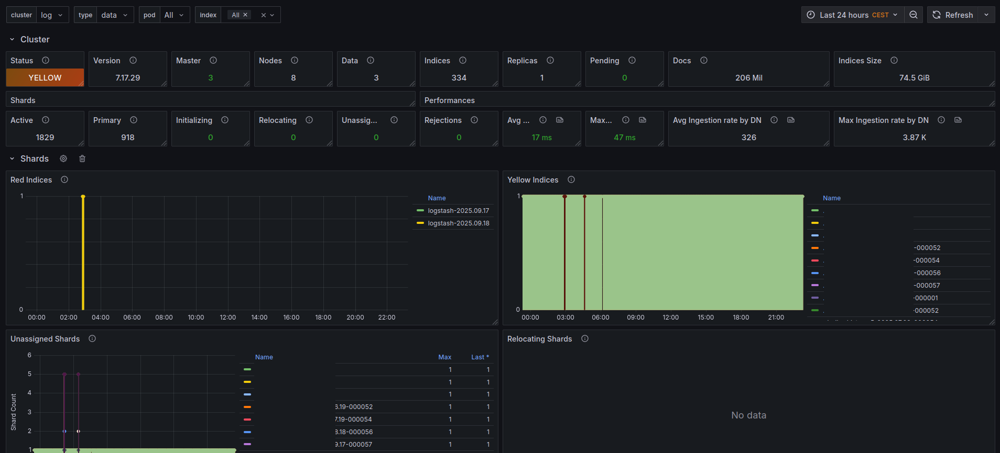](https://github.com/arnaudlemaignen/grafana-dashboards/tree/master/prometheus-ds/elasticsearch)

### [Grafana](https://github.com/arnaudlemaignen/grafana-dashboards/tree/master/prometheus-ds/grafana)
This dashboard needs grafana metrics endpoint to be scraped.
```
- job_name: 'grafana-exporter'
  static_configs:
    -  targets: ['grafana:3000']

```
[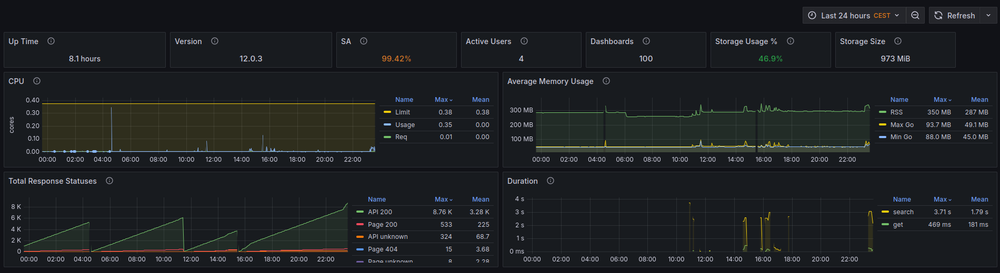](https://github.com/arnaudlemaignen/grafana-dashboards/tree/master/prometheus-ds/grafana)

### [Kafka](https://github.com/arnaudlemaignen/grafana-dashboards/tree/master/prometheus-ds/kafka)
This dashboard needs [kafka exporter](https://github.com/danielqsj/kafka_exporter) and the JMX agent to be activated and scraped.
[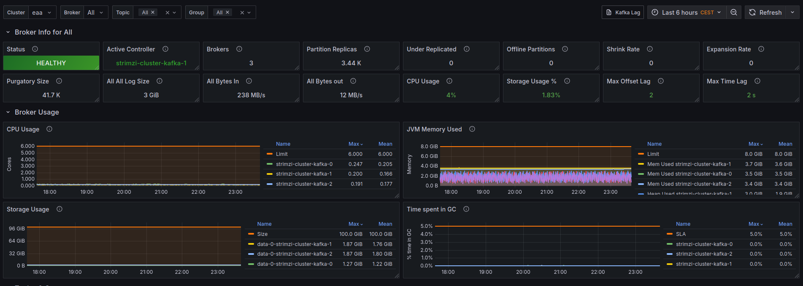](https://github.com/arnaudlemaignen/grafana-dashboards/tree/master/prometheus-ds/kafka)

### [Logstash](https://github.com/arnaudlemaignen/grafana-dashboards/tree/master/prometheus-ds/logstash)
This dashboard needs the [logstash exporter](https://github.com/leroy-merlin-br/logstash-exporter) to be scraped.
[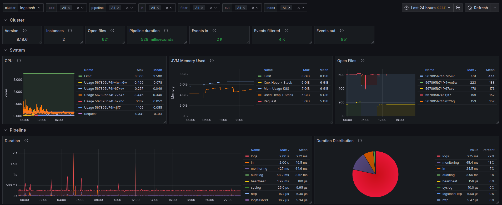](https://github.com/arnaudlemaignen/grafana-dashboards/tree/master/prometheus-ds/logstash)

### [Nodes](https://github.com/arnaudlemaignen/grafana-dashboards/tree/master/prometheus-ds/nodes)
This dashboard needs the node-exporter metrics to be scraped.
[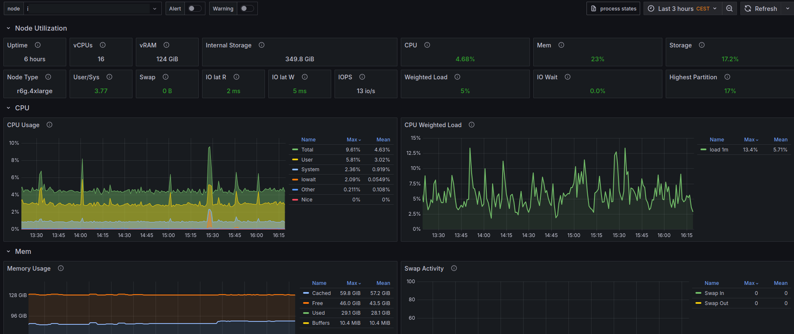](https://github.com/arnaudlemaignen/grafana-dashboards/tree/master/prometheus-ds/nodes)

### [Nodes TOP](https://github.com/arnaudlemaignen/grafana-dashboards/tree/master/prometheus-ds/nodes-top)
This dashboard needs the node-exporter metrics to be scraped.
[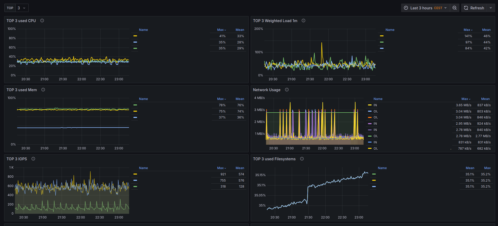](https://github.com/arnaudlemaignen/grafana-dashboards/tree/master/prometheus-ds/nodes-top)

### [Pod Node Issues](https://github.com/arnaudlemaignen/grafana-dashboards/tree/master/prometheus-ds/pod-node-issues)
This dashboard needs the [kube state metrics](https://github.com/kubernetes/kube-state-metrics) to be scraped.
[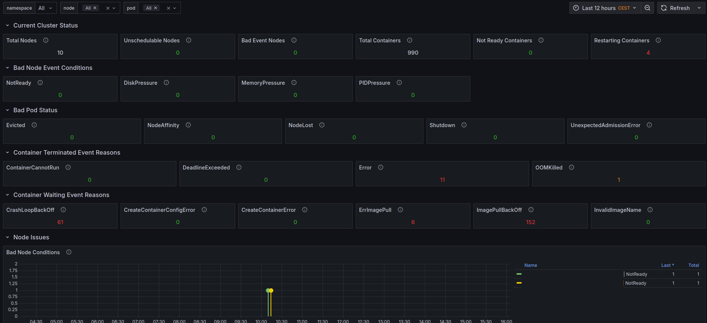](https://github.com/arnaudlemaignen/grafana-dashboards/tree/master/prometheus-ds/pod-node-issues)

### [Pods](https://github.com/arnaudlemaignen/grafana-dashboards/tree/master/prometheus-ds/pods)
This dashboard needs the [kube state metrics](https://github.com/kubernetes/kube-state-metrics) to be scraped.
[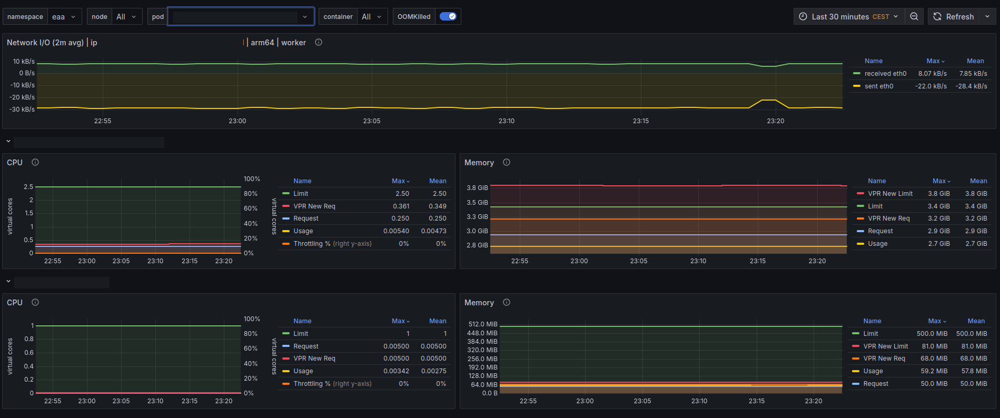](https://github.com/arnaudlemaignen/grafana-dashboards/tree/master/prometheus-ds/pods)

### [Pods Java](https://github.com/arnaudlemaignen/grafana-dashboards/tree/master/prometheus-ds/pods-java)
This dashboard needs the JMX agent to be activated and scraped in all Java containers.
[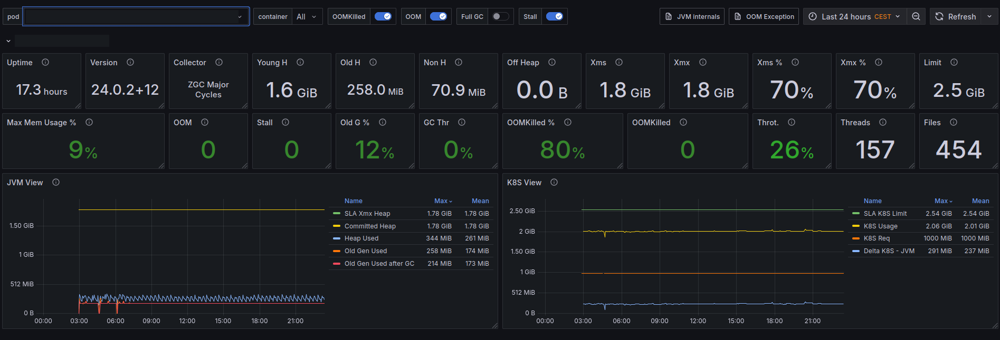](https://github.com/arnaudlemaignen/grafana-dashboards/tree/master/prometheus-ds/pods-java)

### [Pods TOP](https://github.com/arnaudlemaignen/grafana-dashboards/tree/master/prometheus-ds/pods-top)
This dashboard needs the [kube state metrics](https://github.com/kubernetes/kube-state-metrics) to be scraped.
[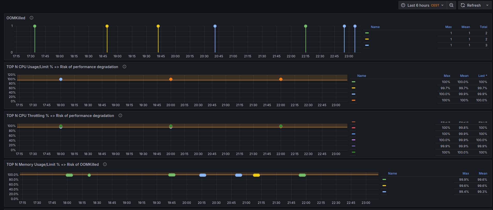](https://github.com/arnaudlemaignen/grafana-dashboards/tree/master/prometheus-ds/pods-top)

### [Prometheus](https://github.com/arnaudlemaignen/grafana-dashboards/tree/master/prometheus-ds/prometheus)
This dashboard needs prometheus metrics endpoint to be scraped.
```
- job_name: 'prometheus'
  static_configs:
    - targets: ['prometheus:8080']
```
[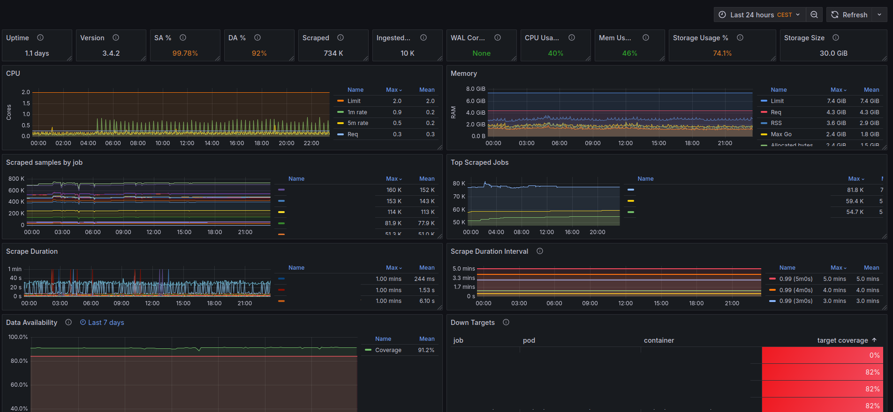](https://github.com/arnaudlemaignen/grafana-dashboards/tree/master/prometheus-ds/prometheus)

### [Prometheus AlertManager](https://github.com/arnaudlemaignen/grafana-dashboards/tree/master/prometheus-ds/alertmanager)
This dashboard needs prometheus alertmanager metrics endpoint to be scraped.
```
- job_name: 'prometheus-am'
  static_configs:
    - targets: ['prometheus-alertmanager:8080']
```
[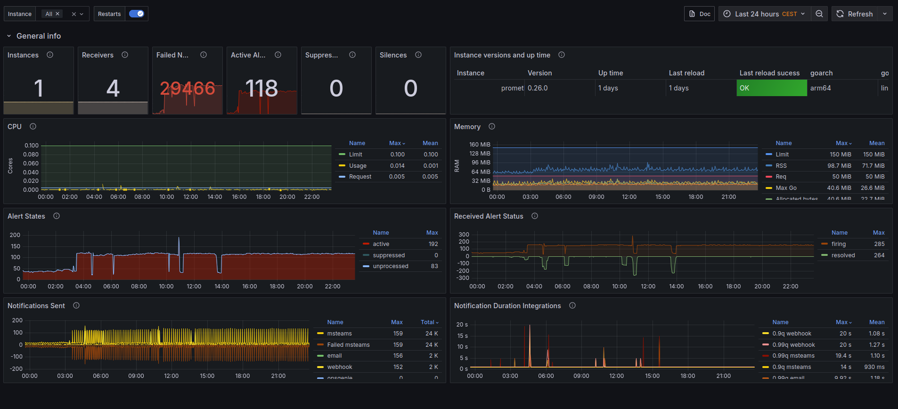](https://github.com/arnaudlemaignen/grafana-dashboards/tree/master/prometheus-ds/alertmanager)

### [PVC](https://github.com/arnaudlemaignen/grafana-dashboards/tree/master/prometheus-ds/pvc)
[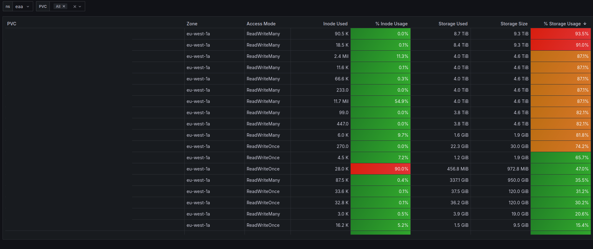](https://github.com/arnaudlemaignen/grafana-dashboards/tree/master/prometheus-ds/pvc)

### [Redis](https://github.com/arnaudlemaignen/grafana-dashboards/tree/master/prometheus-ds/redis)
This dashboard needs the [redis exporter](https://github.com/oliver006/redis_exporter) to be scraped.
[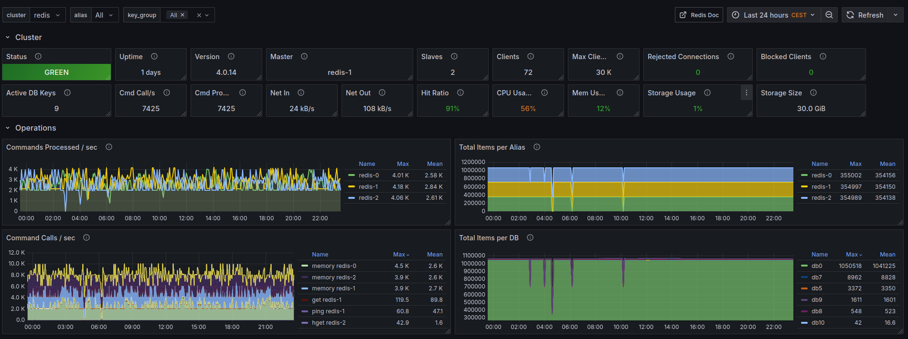](https://github.com/arnaudlemaignen/grafana-dashboards/tree/master/prometheus-ds/redis)

### [VPR](https://github.com/arnaudlemaignen/grafana-dashboards/tree/master/prometheus-ds/vpr)
This dashboard needs the VPR to be running and scraped.
[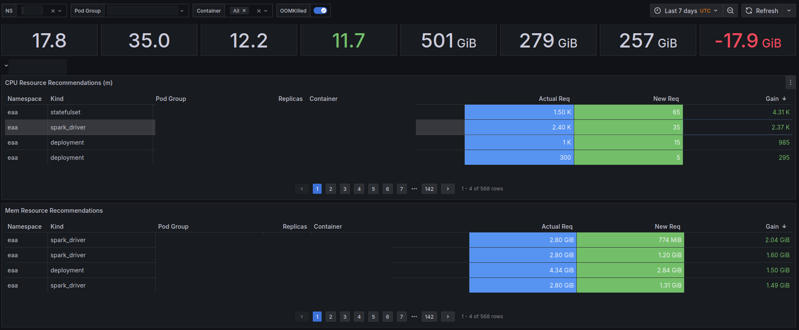](https://github.com/arnaudlemaignen/grafana-dashboards/tree/master/prometheus-ds/vpr)

### [Zookeeper](https://github.com/arnaudlemaignen/grafana-dashboards/tree/master/prometheus-ds/zookeeper)
This dashboard needs the JMX agent to be activated and scraped.
[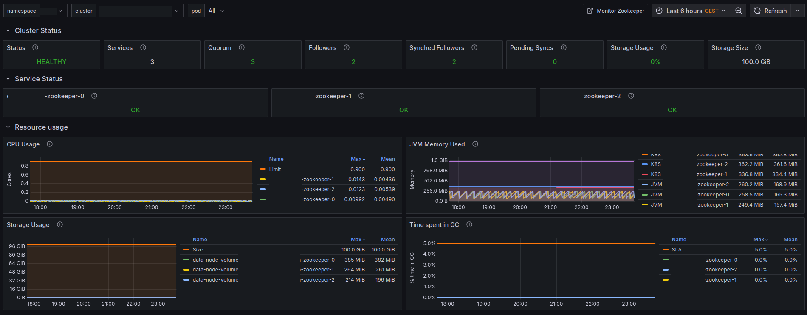](https://github.com/arnaudlemaignen/grafana-dashboards/tree/master/prometheus-ds/zookeeper)


## AWS CloudWatch datasource

Set of AWS Grafana dashboards published on
[grafana.com](https://grafana.com/dashboards?dataSource=cloudwatch)

Here is an example of IAM role for Grafana to use those dashboards:

```
{
    "Version": "2012-10-17",
    "Statement": [
        {
            "Sid": "AllowReadingMetricsFromCloudWatch",
            "Effect": "Allow",
            "Action": [
                "cloudwatch:DescribeAlarmsForMetric",
                "cloudwatch:DescribeAlarmHistory",
                "cloudwatch:DescribeAlarms",
                "cloudwatch:ListMetrics",
                "cloudwatch:GetMetricData",
                "cloudwatch:GetInsightRuleReport"
            ],
            "Resource": "*"
        },
        {
            "Sid": "AllowReadingLogsFromCloudWatch",
            "Effect": "Allow",
            "Action": [
                "logs:DescribeLogGroups",
                "logs:GetLogGroupFields",
                "logs:StartQuery",
                "logs:StopQuery",
                "logs:GetQueryResults",
                "logs:GetLogEvents"
            ],
            "Resource": "*"
        },
        {
            "Sid": "AllowReadingTagsInstancesRegionsFromEC2",
            "Effect": "Allow",
            "Action": [
                "ec2:DescribeTags",
                "ec2:DescribeInstances",
                "ec2:DescribeRegions"
            ],
            "Resource": "*"
        },
        {
            "Sid": "AllowReadingResourcesForTags",
            "Effect": "Allow",
            "Action": "tag:GetResources",
            "Resource": "*"
        }
    ]
}
```


### [AWS AirFlow](https://github.com/arnaudlemaignen/grafana-dashboards/tree/master/cloudwatch-ds/aws-airflow)
[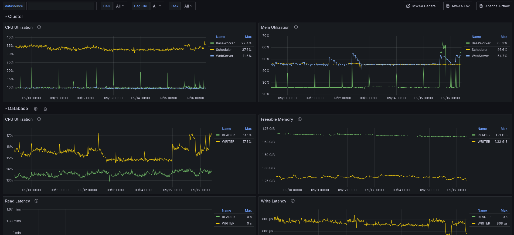](https://github.com/arnaudlemaignen/grafana-dashboards/tree/master/cloudwatch-ds/aws-airflow)

### [AWS Athena Performances](https://github.com/arnaudlemaignen/grafana-dashboards/tree/master/cloudwatch-ds/aws-athena-performances)
[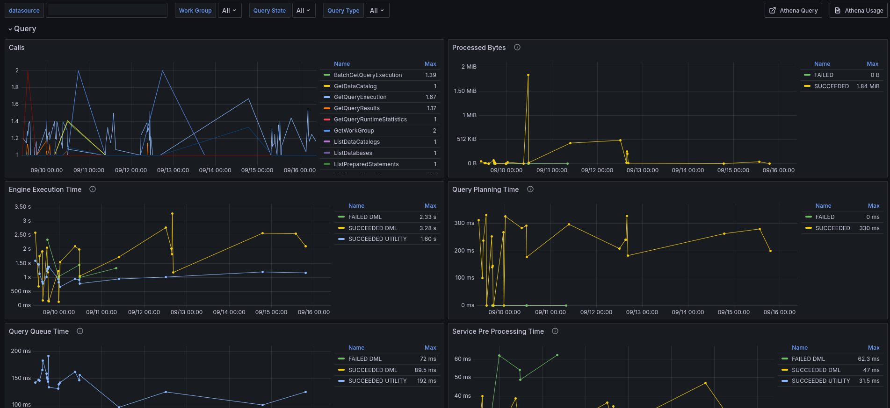](https://github.com/arnaudlemaignen/grafana-dashboards/tree/master/cloudwatch-ds/aws-athena-performances)

### [AWS Bedrock Foundation Models](https://github.com/arnaudlemaignen/grafana-dashboards/tree/master/cloudwatch-ds/aws-bedrock-foundation-models)
[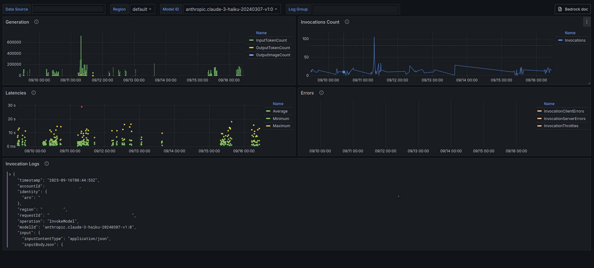](https://github.com/arnaudlemaignen/grafana-dashboards/tree/master/cloudwatch-ds/aws-bedrock-foundation-models)

### [AWS Bedrock GuardRails](https://github.com/arnaudlemaignen/grafana-dashboards/tree/master/cloudwatch-ds/aws-bedrock-guardrails)
[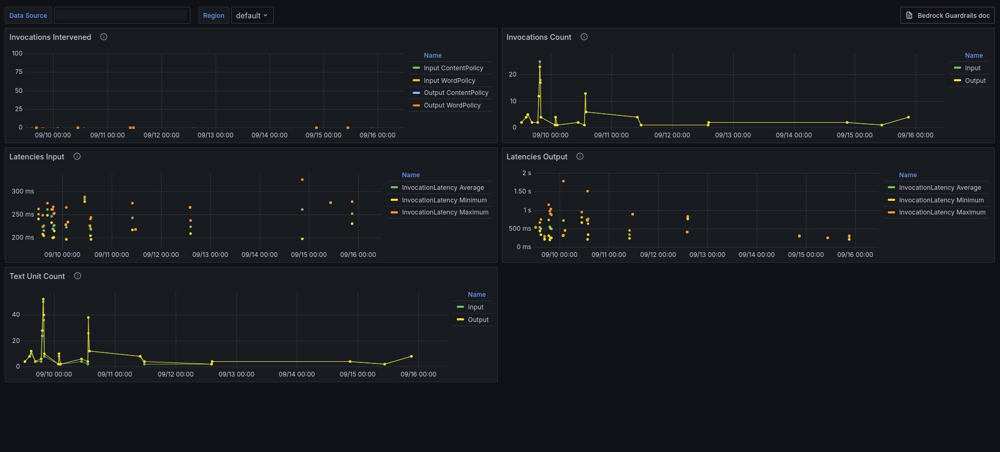](https://github.com/arnaudlemaignen/grafana-dashboards/tree/master/cloudwatch-ds/aws-bedrock-guardrails)

### [AWS Elasticache Redis](https://github.com/arnaudlemaignen/grafana-dashboards/tree/master/cloudwatch-ds/aws-elasticache-redis)
[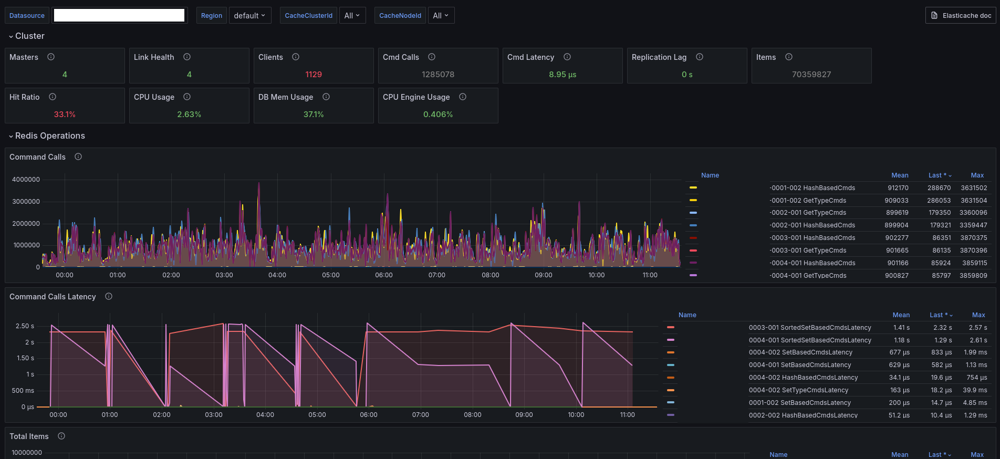](https://github.com/arnaudlemaignen/grafana-dashboards/tree/master/cloudwatch-ds/aws-elasticache-redis)

### [AWS FSx](https://github.com/arnaudlemaignen/grafana-dashboards/tree/master/cloudwatch-ds/aws-fsx)
[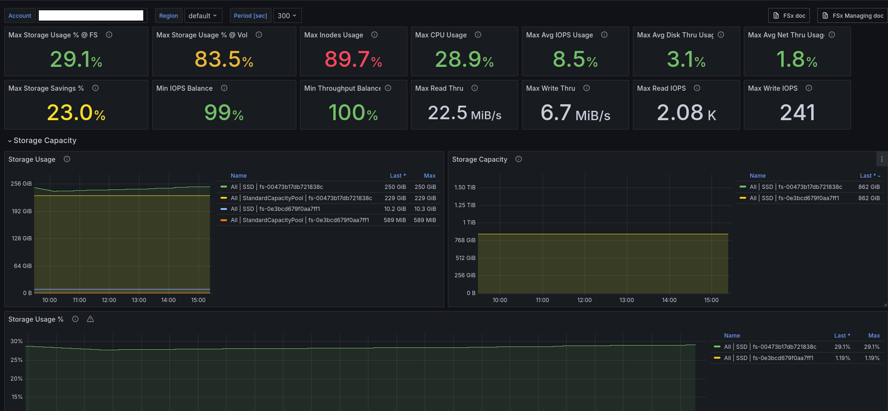](https://github.com/arnaudlemaignen/grafana-dashboards/tree/master/cloudwatch-ds/aws-fsx)

### [AWS Glue](https://github.com/arnaudlemaignen/grafana-dashboards/tree/master/cloudwatch-ds/aws-glue)
[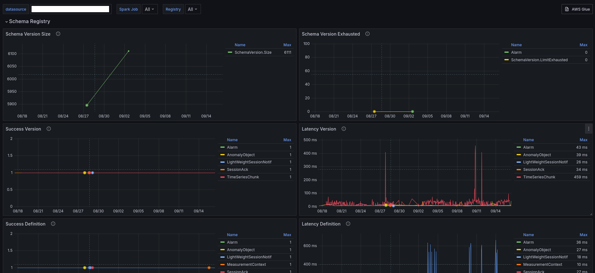](https://github.com/arnaudlemaignen/grafana-dashboards/tree/master/cloudwatch-ds/aws-glue)

### [AWS MSK](https://github.com/arnaudlemaignen/grafana-dashboards/tree/master/cloudwatch-ds/aws-msk)
[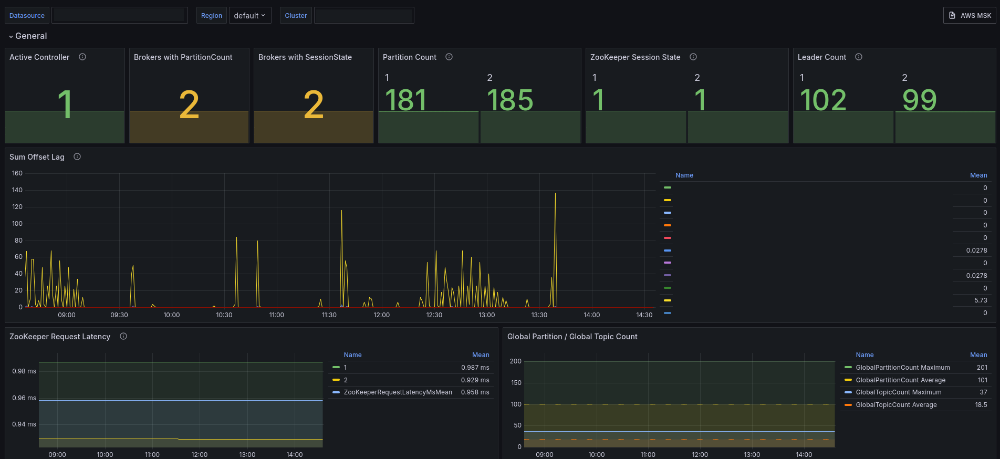](https://github.com/arnaudlemaignen/grafana-dashboards/tree/master/cloudwatch-ds/aws-msk)

### [AWS S3](https://github.com/arnaudlemaignen/grafana-dashboards/tree/master/cloudwatch-ds/aws-s3)
[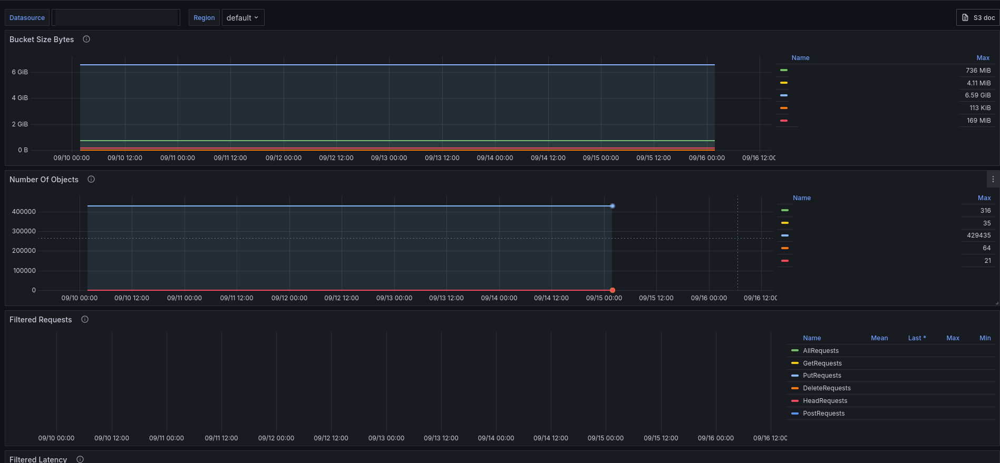](https://github.com/arnaudlemaignen/grafana-dashboards/tree/master/cloudwatch-ds/aws-s3)


## Contributions
Pull requests, comments and suggestions are welcome.